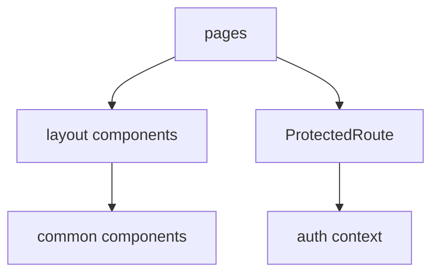
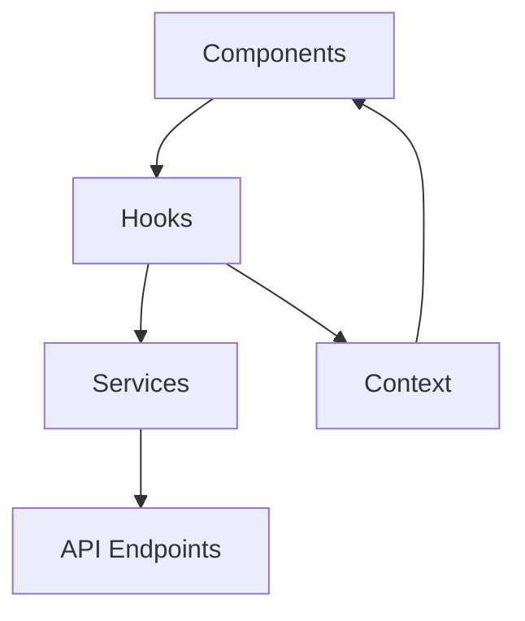

# TransROM-IA Frontend

A modern, responsive web application built with Next.js, TypeScript, and Material-UI for the TransROM-IA project.

## 🚀 Tech Stack

- **Framework**: [Next.js](https://nextjs.org/) 13.4.2
- **Language**: [TypeScript](https://www.typescriptlang.org/)
- **UI Library**: [Material-UI (MUI)](https://mui.com/)
- **State Management**: [Redux Toolkit](https://redux-toolkit.js.org/)
- **Data Fetching**: [TanStack Query (React Query)](https://tanstack.com/query)
- **Styling**: [Tailwind CSS](https://tailwindcss.com/)
- **Form Validation**: [Zod](https://zod.dev/)
- **HTTP Client**: [Axios](https://axios-http.com/)

## 📦 Current Project Structure and Modules

### Source Code Organization
```
src/
├── components/          # React components
│   ├── common/         # Shared components
│   ├── layout/         # Layout components
│   └── ProtectedRoute  # Authentication wrapper
├── config/             # Application configuration
├── contexts/           # React context providers
├── hooks/              # Custom React hooks
├── pages/              # Next.js pages and routing
│   └── auth/          # Authentication pages
├── services/           # API and external services
├── styles/             # Global styles and themes
├── types/              # TypeScript type definitions
└── utils/              # Utility functions
```

### Configuration Files
```
frontend/
├── next.config.js      # Next.js configuration
├── postcss.config.js   # PostCSS configuration
├── tailwind.config.js  # Tailwind CSS configuration
├── tsconfig.json       # TypeScript configuration
└── .eslintrc.json     # ESLint rules
```

### Key Module Interactions

#### 1. Application Entry Points
- `pages/_app.tsx` - Main application wrapper
- `pages/index.tsx` - Landing page
- `pages/auth/*` - Authentication flows

#### 2. Component Architecture


#### 3. Data Management
- `services/` - API integration services
- `contexts/` - State management
- `hooks/` - Custom business logic

#### 4. Styling System
- `styles/globals.css` - Global styles
- `tailwind.config.js` - Tailwind customization
- Material-UI theming

#### 5. Type System
- `types/` - Shared TypeScript interfaces
- `next-env.d.ts` - Next.js type declarations

### Development Tools

#### Scripts
```json
{
  "dev": "next dev",
  "build": "next build",
  "start": "next start",
  "lint": "next lint",
  "lint:fix": "next lint --fix",
  "format": "prettier --write \"src/**/*.{ts,tsx}\"",
  "type-check": "tsc --noEmit",
  "test": "jest",
  "test:watch": "jest --watch"
}
```

#### Code Quality Tools
- ESLint with TypeScript support
- Prettier for code formatting
- Jest for testing
- TypeScript for type safety

## 🛠️ Setup and Installation

1. **Install Dependencies**
   ```bash
   npm install
   ```

2. **Environment Setup**
   - Copy `.env.example` to `.env.local`
   - Update environment variables as needed

3. **Development Server**
   ```bash
   npm run dev
   ```
   The application will be available at `http://localhost:3000`

## 📜 Available Scripts

- `npm run dev` - Start development server
- `npm run build` - Build production bundle
- `npm run start` - Start production server
- `npm run lint` - Run ESLint
- `npm run lint:fix` - Fix ESLint issues
- `npm run format` - Format code with Prettier
- `npm run type-check` - Run TypeScript checks
- `npm run test` - Run tests
- `npm run test:watch` - Run tests in watch mode

## 🧪 Testing

The project uses Jest and React Testing Library for testing. Tests are located next to the components they test.

## 📚 Code Style and Quality

- ESLint for code linting
- Prettier for code formatting
- TypeScript for static type checking
- Pre-commit hooks for code quality

## 🔗 Dependencies

### Main Dependencies
- `@mui/material` & `@mui/icons-material` - Material UI components
- `@reduxjs/toolkit` & `react-redux` - State management
- `@tanstack/react-query` - Server state management
- `zod` - Schema validation
- `axios` - HTTP client

### Development Dependencies
- TypeScript and related type definitions
- Testing libraries (Jest, React Testing Library)
- ESLint and Prettier
- Tailwind CSS and its plugins

## 🤝 Contributing

1. Fork the repository
2. Create a new branch
3. Make your changes
4. Submit a pull request

## 📄 License

This project is licensed under the terms of the [LICENSE](../LICENSE) file.

## 📦 Modules and Interactions

### Components Structure
```
components/
├── common/           # Shared components across the application
│   ├── Button/      # Custom button components
│   ├── Input/       # Form input components
│   └── Card/        # Card layout components
├── layout/          # Layout components
│   ├── Header/      # Application header
│   ├── Footer/      # Application footer
│   ├── Sidebar/     # Navigation sidebar
│   └── Layout/      # Main layout wrapper
└── ProtectedRoute   # Authentication wrapper component
```

### Key Modules and Their Interactions

#### 1. Authentication Flow
- `pages/auth/*` - Authentication pages (login, register, reset password)
- `contexts/AuthContext` - Manages authentication state
- `services/auth.ts` - Authentication API calls
- `components/ProtectedRoute` - Route protection HOC

#### 2. State Management
- `contexts/*` - React Context providers
- `hooks/useAuth` - Authentication custom hook
- `hooks/useApi` - API interaction hook
- `services/*` - API service modules

#### 3. Data Flow


#### 4. Page Structure
- `pages/_app.tsx` - Application wrapper
- `pages/_document.tsx` - Document customization
- `pages/index.tsx` - Landing page
- `pages/dashboard/*` - Dashboard pages
- `pages/auth/*` - Authentication pages

#### 5. Utility Modules
- `utils/api.ts` - API utilities and interceptors
- `utils/validation.ts` - Form validation schemas
- `utils/formatting.ts` - Data formatting utilities
- `utils/storage.ts` - Local storage management

#### 6. Type Definitions
- `types/api.ts` - API response types
- `types/models.ts` - Data model types
- `types/common.ts` - Shared type definitions 